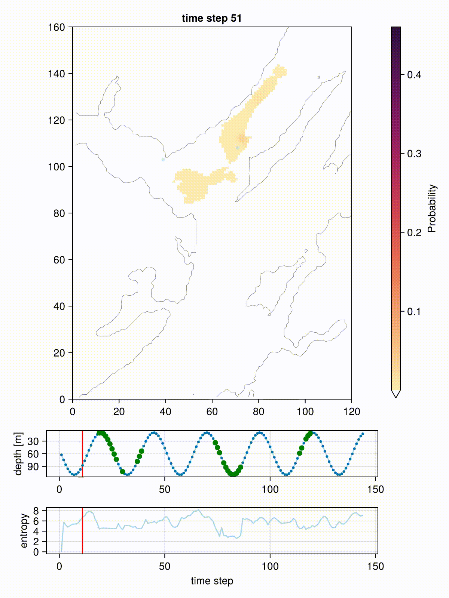

# Wahoo.jl

[](https://scheidan.github.io/Wahoo.jl/stable/)
[](https://scheidan.github.io/Wahoo.jl/dev/)
[](https://github.com/scheidan/Wahoo.jl/actions/workflows/CI.yml?query=branch%3Amain)
[](https://codecov.io/gh/scheidan/Wahoo.jl)

## Installation

`] add git@github.com:scheidan/Wahoo.jl.git`

## Usage

Minimal example using example data that come with `Wahoo.jl`:

```Julia
using Wahoo

import GeoArrays
using DelimitedFiles: readdlm

# This is optional. If *both* packages are imported,
# some computations use the GPU. Otherwise, the CPU is used for everything.
import CUDA
import cuDNN


# -----------
# 1) Read data
# -----------

# Read example data that come with Wahoo
pathdata = joinpath(pkgdir(Wahoo), "example_data")

# -- bathymetry

bathymetry_map = GeoArrays.read(joinpath(pathdata, "bathymetry_200m.tif"))
GeoArrays.bbox(bathymetry_map)           # shows coordinates of corners


# -- depth observations

# define likelihood function
function p_obs_depth(signals, t, depth::Number, dist::Number)
	# We are lazy and using a predefined function here.
    Wahoo.p_depth_exponential(signals[t], depth, dist)
end

# read signals
depth_signals = readdlm(joinpath(pathdata, "depth_observations.csv"), ',', header=true)[1][:,2]


# -- acoustic observations

# define likelihood function
function p_obs_acoustic(signals, t::Int, depth::Number, distance::Number)
    Wahoo.p_acoustic_sigmoid(signals[t], depth, distance)
end

# read signals
acoustic_signals = readdlm(joinpath(pathdata, "acoustic_observations.csv"), ',', header=true)[1][:,2:3]
acoustic_signals = Int.(acoustic_signals')

# vector of vectors:
acoustic_obs = [acoustic_signals[1,:], acoustic_signals[2,:]]
acoustic_obs_models = [p_obs_acoustic, p_obs_acoustic]

# read positions
moorings = readdlm(joinpath(pathdata, "acoustic_moorings.csv"), ',', header=true)[1]
acoustic_pos = tuple.(moorings[:,2], moorings[:,3])


# -----------
# 2) Define parameters
# -----------


# initial values: Matrix{Float64}
p0 = zeros(size(bathymetry_map)[1], size(bathymetry_map)[2])
idx = GeoArrays.indices(bathymetry_map, (709757.111649658, 6.26772603565296e6)) # last known location of the fish
p0[idx] = 1

tsave = 1:2:720             # time steps to save
movement_std = 100          # standard deviation of the fish movement for one time step [m]
spatial_resolution = 200    # spatial resolution [m]


# -----------
# 3) Run inference
# -----------

res = track(pos_init = p0, bathymetry = bathymetry_map,
            tsave = tsave,
            spatial_resolution = spatial_resolution,
            movement_std = movement_std,
            observations = [depth_signals, acoustic_obs...],
            observation_models = [p_obs_depth, acoustic_obs_models...],
            sensor_positions = [nothing, acoustic_pos...],
			n_trajectories = 2);

# Resulting probabilities
# Array{Float32, 4}: Ny × Nx × 1 × time
res.pos_filter       # Prob(s_t | y_{1...t})
res.pos_smoother     # Prob(s_t | y_{1...T})
res.residence_dist   # 1/T Σ Prob(s_t | y_{1...T})
res.trajectories     # Vector of trajectories sampled from Prob(s_{1...T} | y_{1...T})
res.log_p            # Prob(y_t)
res.tsave            # time points
```

The inferred probabilities using smoothing:




### Defining observations models

The user must define an observation model for every sensor, which is a
function that computes the probability (density) of
the observed signal given the location, `p(y_t | s_t)`.

The function must have the following signature:
```
 p_obs(signals, t::Int, bathymetry_depth::Number, dist::Number)
```
where `bathymetry_depth` is the water depth at `s_t` and `dist` is the Euclidean
distance from `s_t` to the sensor location. Note, the function must
accept all four arguments, even if some are not used.

Note that if GPU use is planned, the function must be type-stable.


### GPU usage

To use the GPU for computations, the packages `CUDA.jl` _and_ `cuDNN.jl`
must be imported. Currently, only CUDA-compatible GPUs are supported.


## References

The filter and smoother implementation is based on:

Thygesen, Uffe Høgsbro, Martin Wæver Pedersen, and Henrik
Madsen. 2009. “Geolocating Fish Using Hidden Markov Models and Data Storage Tags.” In Tagging and Tracking of Marine Animals with Electronic Devices, 277–93. Dordrecht: Springer Netherlands. https://doi.org/10.1007/978-1-4020-9640-2_17.
