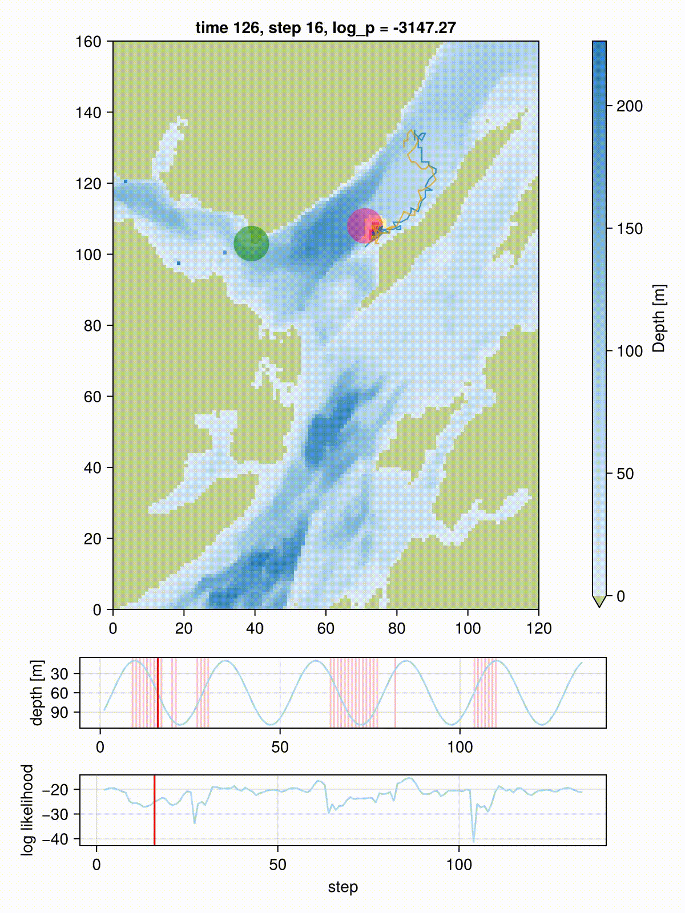

# Wahoo.jl

`Wahoo` is a Julia package designed for tracking the movement of marine
animals using probabilistic state-space models. The inference is based
on a discretization of space and does not use particle filters. This
 makes `Wahoo` work well even when the bathymetry is very rugged.

For more information please see the
[documentation](https://scheidan.github.io/Wahoo.jl/dev/).

## References

The filter and smoother implementation is based on:

Thygesen, Uffe Høgsbro, Martin Wæver Pedersen, and Henrik
Madsen. 2009. “Geolocating Fish Using Hidden Markov Models and Data Storage Tags.” In Tagging and Tracking of Marine Animals with Electronic Devices, 277–93. Dordrecht: Springer Netherlands. https://doi.org/10.1007/978-1-4020-9640-2_17.

The example bathymetry data is derived from the following survey:

Howe JA, Anderton R, Arosio R, et al. The seabed geomorphology and geological structure of the Firth of Lorn, western Scotland, UK, as revealed by multibeam echo-sounder survey. Earth and Environmental Science Transactions of the Royal Society of Edinburgh. 2014;105(4):273-284. doi:10.1017/S1755691015000146
